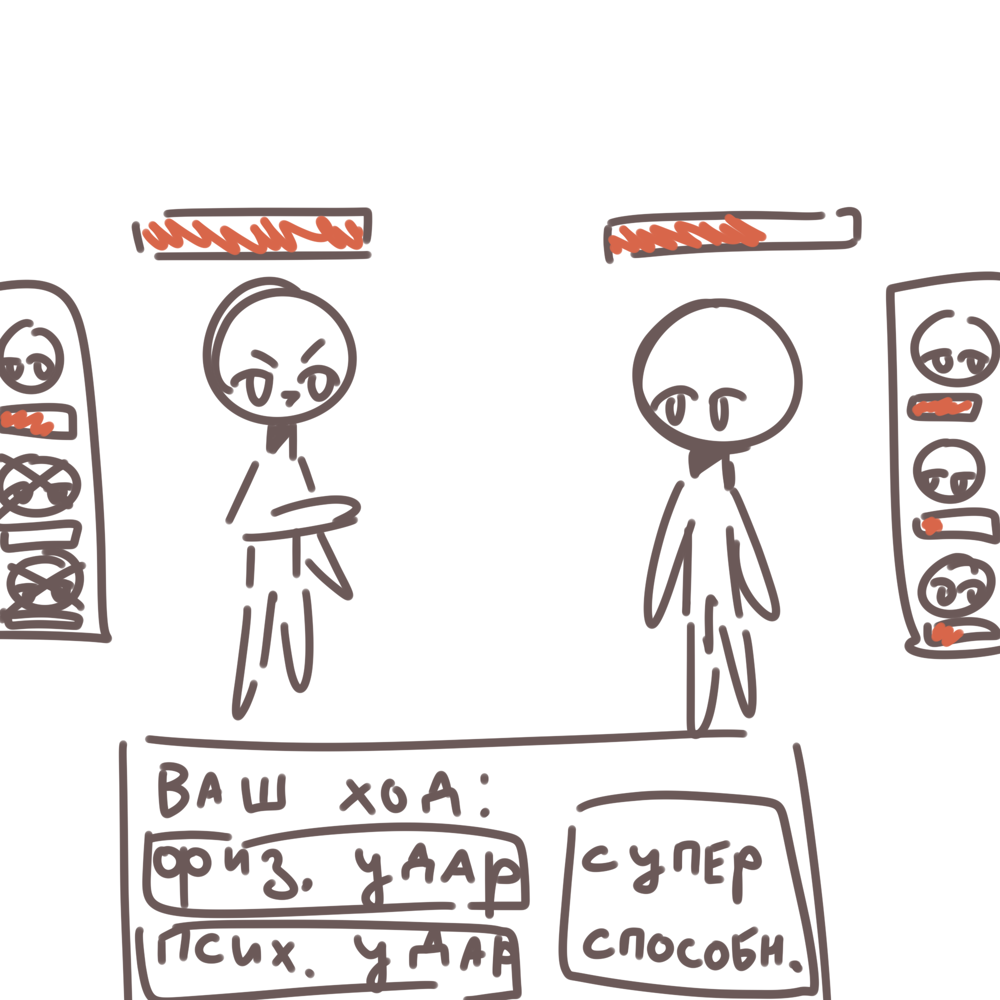

<h1>
    План разработки игры "Битва карточек"
</h1>
<h2>Суть игры</h2>

    Суть игры следующая: есть два игрока, которые сражаются друг против друга. У каждого игрока есть набор карточек, которые они заработали в Дискорде. По сути эти карточки представляют собой что-то вроде покемонов, у них есть 4 характеристики (здоровье, сила, ловкость и ум), и суперспособности. Игроки ходят по очереди, на каждом ходу они могут совершать атаки только той карточкой, что стоит впереди.

    Когда карточка получает урон, она теряет здоровье. Когда здоровье доходит до нуля, карточка умирает и больше не может использоваться. Когда все карточки игрока вышли из боя, ему объявляется поражение. Победы и поражения сохраняются и отправляются на сервер бота, где их можно будет посмотреть через команду.

    <strong>Цель игры</strong>: заработать как можно больше побед над противниками, возможно будут награды и ранги (серебряный, золотой, платиновый, алмазный)

<h2>Разработка</h2>
<h3>Первый этап</h3>

    На первом этапе необходимо создать MVP: Mininum Viable Product (минимально работающий прототип). Этим MVP будет что-то такое:

    

    На экране будут отображаться персонаж противника и персонаж игрока. У них над головами будут health бары (пока что без надписей). Посередине экрана снизу будет кнопка (без подписи), при нажатии на которую совершается атака на противника. После атаки здоровье карточки уменьшается и health бар становится менее заполненным. Когда он доходит до нуля, объявляется победа первого игрока.

<h3>Доработка MVP</h3>
<h4>Ходы противника</h4>

    Сделать очередность хода: когда игрок совершает действие, он дожидается хода противника. Соответственно противник тоже совершает действие и передает управление обратно.
    <ul>
        <li>Как совершать действие противника, если сетевое взаимодействие еще не готово?</li>
        <li>Как понять, когда противник совершил ход?</li>
        <li>Как игнорировать команды игрока, пока ход противника не завершился?</li>
    </ul>

<h4>Анимация атаки</h4>

    При атаке нужно проигрывать анимацию поверх спрайта персонажа противника. До окончания анимации ход не передается противнику и здоровье не уменьшается. В будущем у каждой атаки будет своя анимация, поэтому нужно предусмотреть заранее общий способ проигрывания анимаций.

<h4>Звуковые эффекты</h4>

    При атаке нужно проигрывать звуковой эффект, причем как при своей атаке, так и при атаке противника.

<h4>Искусственный интеллект</h4>

    Чтобы противник не стоял на месте и не был грушей для битья, ему нужно добавить ум. Пусть на каждом ходу он вычисляет нужное действие и применяет его (единственным действием пока что является атака, но потом появятся другие). Результат игры больше не фиксированный, победить может как игрок, так и противник, это надо учитывать.

</body>
